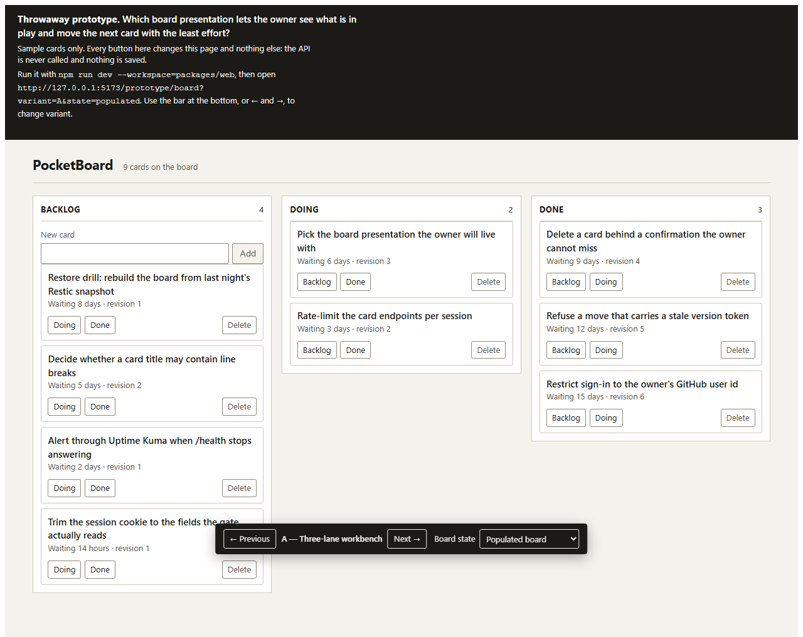
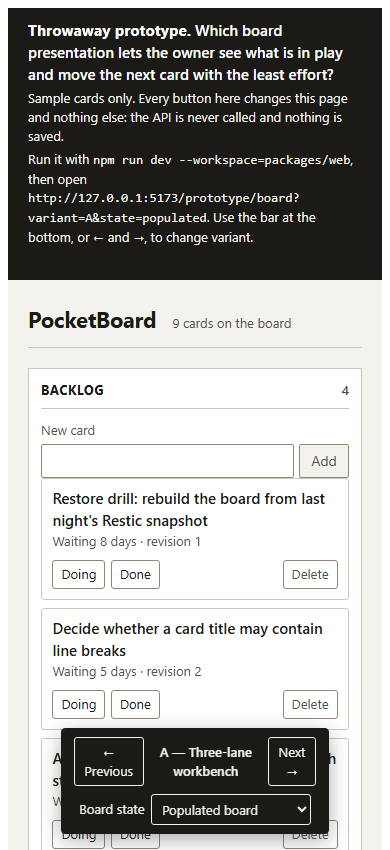
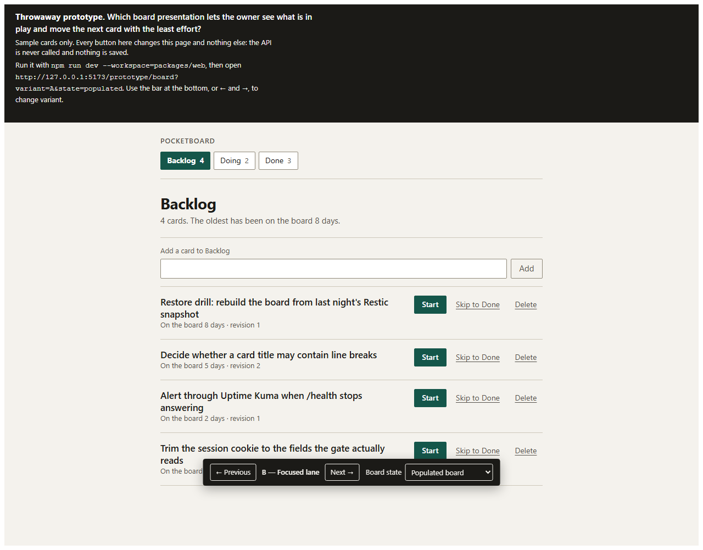
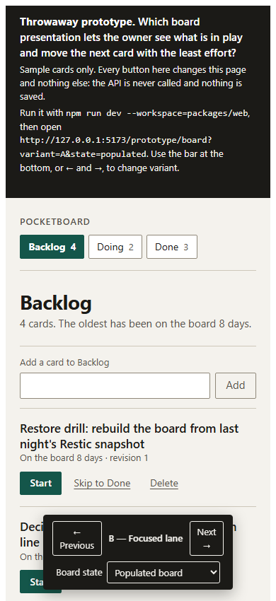
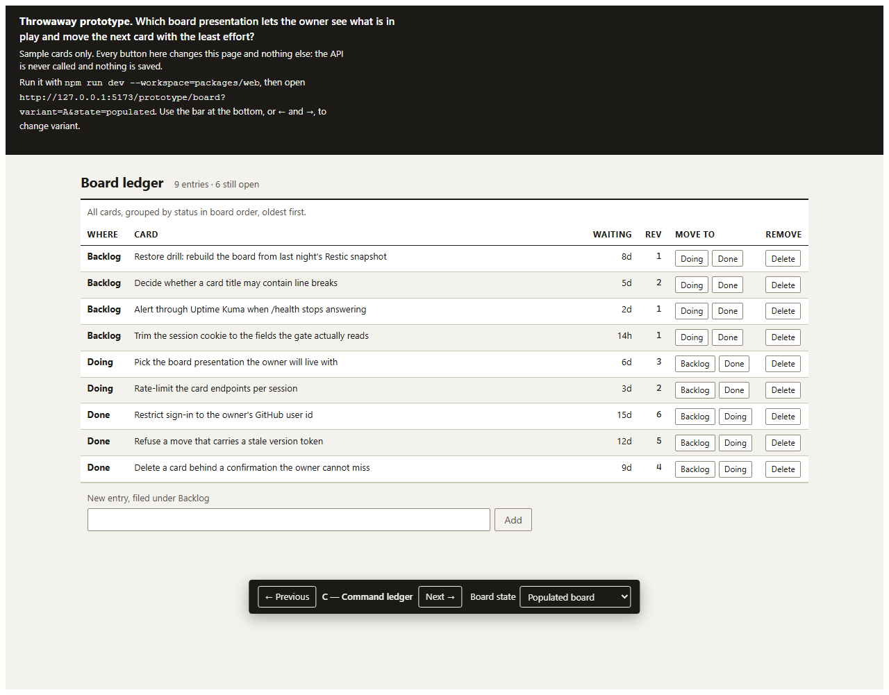
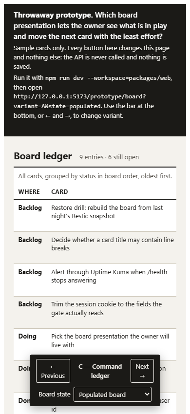

# Board UI prototype — selection artifact (do not merge)

**This branch exists so the owner can pick a board layout. Its pull request must
not be merged.** Everything under `packages/web/src/prototype/` is throwaway
code written for GitHub issue #6 under prototype rules — no tests, no error
handling, no abstractions. Once a variant wins, this folder is deleted and the
winner is rewritten properly against the real API.

**Question:** which board presentation lets the owner see what is in play and
move the next card with the least effort?

Three variants on one development-only route, switchable via `?variant=`. The
prototype never calls the API and nothing it shows is saved; the cards are fixed
sample data.

## Run it

```
npm run dev --workspace=packages/web
```

Then open:

```
http://127.0.0.1:5173/prototype/board?variant=A&state=populated
```

Switch variants with the bar at the bottom of the screen, or with `←` and `→`
when focus is not inside a field, a button, or the ledger. Switch board states
with the **Board state** menu in the same bar. Both are written back into the
URL, so any combination can be shared or reloaded.

## Variants

Screenshots below are the populated board. Desktop is 1280px wide (full page);
narrow is a 390×850 phone viewport.

### A — Three-lane workbench

All three statuses side by side, stacking to one column below 900px. A card's
position is the signal, and each card names the lanes it can move to.

| Desktop | Narrow |
| --- | --- |
|  |  |

**For:** the whole board is legible at a glance, and moving is one click from
wherever the card already sits. **Against:** at phone width the three lanes
become a long scroll, so "the whole board at a glance" — the reason to pick it —
is the first thing lost.

### B — Focused lane

One status fills a reading column, reached through status navigation. The
primary move is the single step forward: **Start**, **Finish**, **Reopen**, with
the sideways move and Delete demoted.

| Desktop | Narrow |
| --- | --- |
|  |  |

**For:** the same layout works at both widths, and the one obvious move per card
makes the common path fast. **Against:** two of the three statuses are always
hidden, so nothing shows what is piling up elsewhere without navigating.

### C — Command ledger

One flat register, one row per card, ordered by status then by age. No card
surfaces anywhere. The deciding fields come first: Where, Card, Waiting, Rev.

| Desktop | Narrow |
| --- | --- |
|  |  |

**For:** the densest view of the board, and the only one that makes "what has
been waiting longest" answerable by reading down a column. **Against:** the
register is wide.

> **Residual tradeoff, accepted in review:** at narrow widths the ledger keeps
> all its columns and scrolls sideways instead of dropping any. The scroll
> region is labelled and focusable, and arrow keys scroll it rather than
> switching variants, so it is fully keyboard-accessible — but on a phone the
> Waiting, Rev, Move to and Remove columns are reached only by scrolling
> horizontally. The narrow screenshot above shows the register at its starting
> position. This is a real cost to weigh against A and B, not a defect.

## Board states

`?state=` takes `populated`, `empty`, `loading`, `error`, or `conflict`. Each
variant renders all five, so the states can be compared as well as the layouts.
`conflict` is the stale-version refusal from issue #4: the board stays as the
owner last read it, the contested card is marked where it sits, and the notice
says a reload is the only way forward.

## If a variant is selected

- **A and C need a `<main>` landmark added.** Only B currently wraps its board
  in `<main>`; A and C render into plain containers. Whichever wins must gain
  the landmark when it is rewritten for production.
- The winner is rewritten against the real API, with the tests, error handling
  and accessibility work that production requires. The prototype code is not
  promoted as-is.
- This whole folder — variants, switcher, fixtures, screenshots and these notes
  — is deleted in that same change.

## Production safety

`App.tsx` reaches this folder only inside `import.meta.env.DEV`. Vite replaces
that with `false` when building, so the branch is dead code and the entire
folder is dropped from the production bundle: the build emits no prototype
strings and no CSS asset at all. `/prototype/board` in production falls through
to `AuthGate` like any other unknown path, and `App.test.tsx` pins that.

## Verdict

_Not chosen yet._ Record the owner's choice and the reason on issue #6, then do
the follow-up above.
